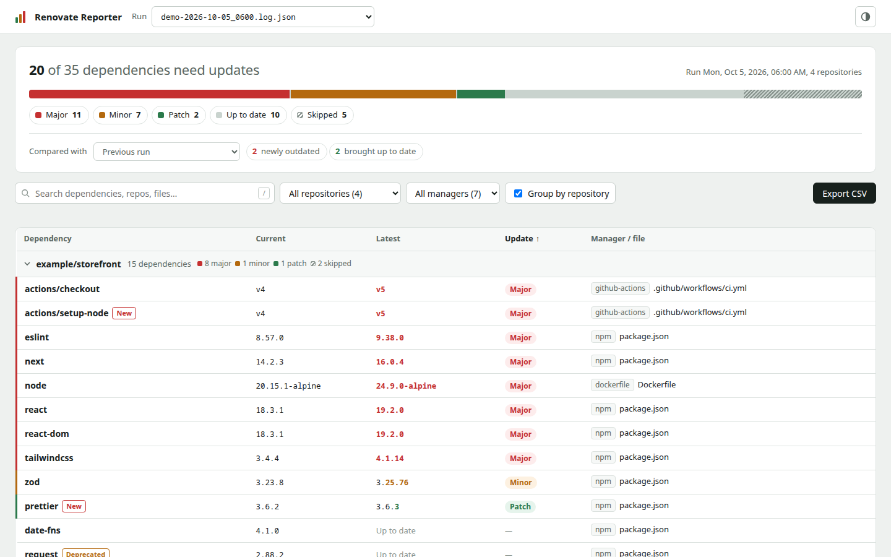
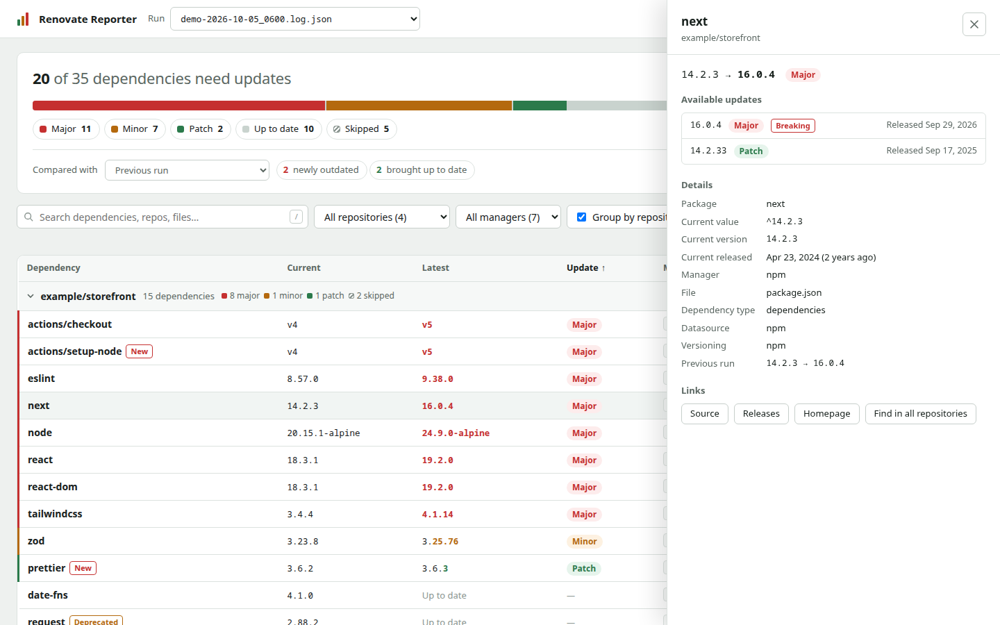
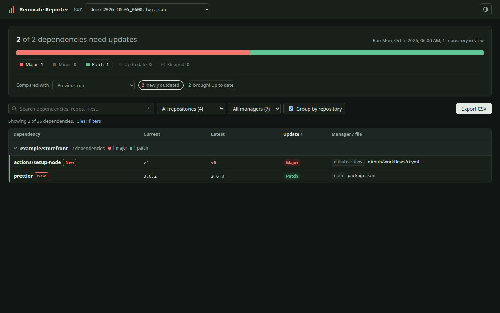

# Renovate Reporter

Renovate Reporter is a small web UI for browsing dependency data extracted from Renovate debug logs.

Point it at a directory of Renovate `.json` or `.log.json` files, then open the local web UI to see which dependencies need updates, how risky those updates are, and what changed since the previous run.



## Features

- Parses newline-delimited JSON Renovate debug logs.
- Serves a self-contained web UI on a local HTTP port.
- Summarizes each run by update type (major, minor, patch), up to date, and skipped dependencies. Click any segment to filter.
- Compares a run with the previous run (or any other run) to show newly outdated dependencies and dependencies brought up to date.
- Groups dependencies by repository, with the repositories that have the most severe pending updates listed first.
- Filters by free-text search, repository, and manager. The current view is kept in the URL so it can be bookmarked or shared.
- Shows a details panel for each dependency with every available update, release dates, breaking-change flags, skip reasons, Renovate warnings, deprecation notices, and links to the source, releases, and changelog.
- Exports the rows currently shown as CSV.
- Polls the log directory every 30 seconds for new, changed, and removed `.json` files.
- Works on small screens and supports light and dark themes.
- Runs as a standalone CLI binary or a minimal container image.

| Dependency details | Newly outdated since the previous run (dark theme) |
| --- | --- |
|  |  |

## Install From Source

```sh
go install github.com/acaylor/renovate-reporter@latest
```

## Download A Release

Prebuilt binaries are attached to each GitHub release:

```text
https://github.com/acaylor/renovate-reporter/releases
```

Release tags also publish matching container images. For example, for `v0.1.0`:

```sh
docker run --rm \
  -p 8080:8080 \
  -v "$PWD/logs:/logs:ro" \
  ghcr.io/acaylor/renovate-reporter:v0.1.0
```

## CLI Usage

```sh
renovate-reporter [--port N] <logs-dir>
```

Example:

```sh
renovate-reporter --port 8080 ./logs
```

Then open:

```text
http://localhost:8080
```

To try it without your own logs, use the bundled demo data:

```sh
go run . testdata/demo
```

### Keyboard shortcuts

- `/` focuses the search box.
- `↑` and `↓` move between rows, and `Enter` opens the selected dependency.
- `Esc` closes the details panel or clears the search.

### Shareable views

Filters are stored in the URL fragment, for example `http://localhost:8080/#status=major,minor&repo=example/storefront`. Supported keys are `log`, `vs` (comparison run, or `none`), `status` (`major`, `minor`, `patch`, `other`, `current`, `skipped`), `delta` (`new` or `resolved`), `q`, `repo`, `manager`, `group=0`, and `sort`.

## Docker Usage

The container expects Renovate logs to be mounted at `/logs`.

```sh
docker run --rm \
  -p 8080:8080 \
  -v "$PWD/logs:/logs:ro" \
  ghcr.io/acaylor/renovate-reporter:latest
```

Then open:

```text
http://localhost:8080
```

To use a different host port:

```sh
docker run --rm \
  -p 9090:8080 \
  -v "$PWD/logs:/logs:ro" \
  ghcr.io/acaylor/renovate-reporter:latest
```

Then open `http://localhost:9090`.

## Docker Compose Example

```yaml
services:
  renovate-reporter:
    image: ghcr.io/acaylor/renovate-reporter:latest
    ports:
      - "8080:8080"
    volumes:
      - ./logs:/logs:ro
```

## Log Format

Renovate Reporter reads each `.json` file in the log directory. It is designed for Renovate debug logs written as newline-delimited JSON.

It looks for Renovate log entries that contain repository configuration data and extracts dependencies from manager entries with `packageFile` and `deps` fields. Each dependency's `updates`, `skipReason`, `warnings`, `deprecationMessage`, `sourceUrl`, `homepage`, and `changelogUrl` fields are used when present.

Runs are ordered by file name, newest first, so names that start with or contain a sortable timestamp (for example `renovate-2026-10-05_0600.log.json`) give the best results. When a file name contains a date, the UI shows it as the run time.

## HTTP Endpoints

The web UI uses these local endpoints:

- `GET /api/logs`
- `GET /api/deps?log=<filename>` returns the dependency rows, including `updateType`, `updates`, `skipReason`, `warnings`, and link fields when Renovate reported them
- `GET /api/status`
- `GET /export?log=<filename>` returns every row of a log as CSV. The UI's Export CSV button exports only the rows currently shown.

## Development

Run tests:

```sh
go test ./...
```

Build the CLI:

```sh
go build -o renovate-reporter .
```

Build the container image:

```sh
docker build -t renovate-reporter .
```

## License

MIT
